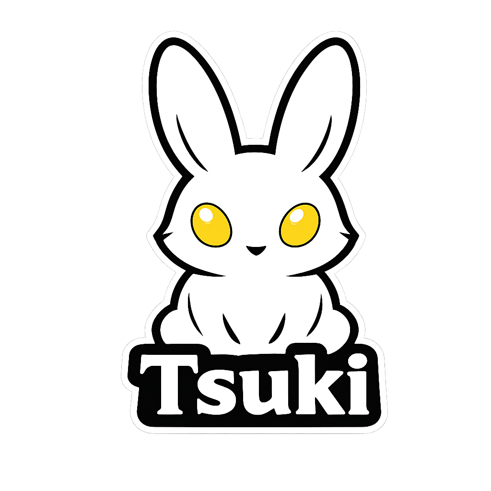

# <div align="center">Tsuki</div>

<div align="center">

### _Paste tag soup._

### _Click what matters._

### _Walk away with weighted prompt text._

</div>

<br>

<div align="center"></div>

<br>

<div align="center"></div>

<br>

<div align="center"><a href="https://buymeacoffee.com/waypointnull"></a></div>

---

<div align="center">

## What this is

</div>

Tsuki is a tag-strength editor.

Akumu hands you a pile of Danbooru tags.

Tsuki lets you decide which of them actually matter.

Paste a comma-separated list, click the tags to strengthen or weaken them, copy the weighted prompt text back out.

No LLM.

No tag autocomplete keyboard gymnastics.

Just a moonlit table, a list of tags, and clicking.

The tags get sorted into six buckets so you can see what you're working with:

```text
Boilerplate   NSFW   Clothes   Composition   Pose   Misc
```

LoRA trigger tags get their own input (inside the Source box above) and their own card in the grid — paste the trigger list there and it stays out of Misc.

---

<div align="center">

## Why?

</div>

Because the weights are the part everyone hand-waves.

Getting the right tags is only half the job.

Knowing whether `blue_hair` deserves `1.2` or `0.8` is the other half.

Manually editing parentheses in a textarea is a special kind of misery.

So now the textarea does what textareas hate:

```text
(cat:1.1), [dog:0.8], plain, ((bird))
```

It turns that back into a list of tags with readable strengths.

You click.

It remembers.

---

<div align="center">

## What this stupid thing actually does

</div>

You paste:

```text
masterpiece, best quality, catgirl, blue_hair, side_ponytail
```

Tsuki splits the main prompt into entries and sorts them into the six category cards. Paste your LoRA's trigger tags into the LoRA box (inside Source) and they land in a dedicated LoRA card instead of Misc.

Then you click:

- **Left-click** a tag to nudge it up.
- **Right-click** a tag to nudge it down.
- **Shift-click** a tag (or hit the â‹® button) to get real Danbooru suggestions with **Add** and **Replace**.
- Hit the **×** to delete a tag. It'll ask first. Shift-click skips the asking.

When you're done, copy the weighted text out:

```text
masterpiece, best quality, (catgirl, blue_hair:1.1), [side_ponytail:0.9]
```

Tags sharing a strength get wrapped together, because nobody needs `(clouds:1.2), (moonlight:1.2)` when `(clouds, moonlight:1.2)` exists.

> [!NOTE]
> Everything runs locally.
>
> No cloud.
>
> No accounts.
>
> No API keys.
>
> No telemetry.
>
> Just a very opinionated tag list.

---

<div align="center">

## Stuff it does

</div>

- 🍜 **Paste → six category cards.** Boilerplate, NSFW, Clothes, Composition, Pose, and a Misc bucket for everything that refuses to behave.
- ✨ **LoRA trigger card.** A separate input inside the Source box holds your LoRA's trigger tags (e.g. `kroniidef, short hair, hair intakes`); they live in a dedicated LoRA grid card — same ± and ×, no suggestion menu — never dumped in Misc.
- 🖱️ **Click to weight.** Left nudges up, right nudges down. No typing weights by hand.
- 🔍 **Real Danbooru suggestions.** Shift-click or ⋮ opens a menu backed by a **314,000+ tag** database. Aliases get resolved, typos get corrected, and the NSFW stuff gets politely kept out of the suggestions.
- ⚖️ **Grouped rendering.** Consecutive tags at the same strength share one wrapper.
- 🗑️ **Deletes that ask permission.** Shift-click skips the conversation.
- 📋 **One-click copy** because selecting text is exhausting.
- 📦 Works fully offline, and quietly becomes a UsagiAI resident if the hub happens to be around.

---

<div align="center">

## How the magic works

_(It's just a tag list with opinions.)_

</div>

```text
You paste:

    "masterpiece, best quality, catgirl, blue_hair, side_ponytail"

                │
                â–¼

Split into entries.

                │
                â–¼

Sorted into six category cards.

                │
                â–¼

You click tags.
Left nudges up, right nudges down.

                │
                â–¼

Equal strengths get grouped.

                │
                â–¼

masterpiece, best quality, (catgirl, blue_hair:1.1), [side_ponytail:0.9]
```

The whole pipeline is deterministic.

No model is guessing anything.

---

<div align="center">

## Before you complain it doesn't work

</div>

You'll need:

- Node.js 18+

That's it.

No Ollama.

No model download.

No tokens.

---

<div align="center">

## Go do the thing

</div>

```powershell
npm install
npm run build
npm start
```

Then open:

```
http://127.0.0.1:5179
```

Congratulations.

You now have another localhost tab you'll forget to close.

---

### First startup

Tsuki downloads the tag database the first time it runs.

It's around **314,000 tags** and change.

So yes...

...the first launch takes a minute.

No, it's not frozen.

---

<div align="center">

## Random tips

</div>

- Base strength is `1.0` — a bare tag. Every click moves it `0.1`.
- `(tag)` boosts, `[tag]` softens, `{tag}` gives a gentle boost.
- Anything the six categories can't place ends up in **Misc** (LoRA tags have their own list now). That's its job. Stop complaining.
- If a suggestion looks weird, that's what **Replace** is for — and the menu shows you the post count before you commit.

---

<div align="center">

## If you insist on reading the code

</div>

```powershell
npm run dev
```

Runs:

- Express backend
- Vue dev server
- The usual web development ritual

Useful commands:

| Command             | Does the thing                          |
| ------------------- | --------------------------------------- |
| `npm test`          | Makes sure I didn't break everything.   |
| `npm run lint`      | Complains about my formatting.          |
| `npm run format`    | Makes Prettier win the argument.        |
| `npm run bench`     | Benchmarks the tag matcher.             |
| `npm run roundtrip` | Verifies paste → edit → re-paste holds. |
| `npm run demo`      | Runs the pure modules with no server.   |

---

<div align="center">

## Where everything lives

</div>

```text
server/
    Backend.
    Splits, classifies, renders, matches tags.

client/
    Pretty buttons.

scripts/
    Tiny utilities because typing long commands sucks.

data/
    Home of an absolutely enormous Danbooru tag list.
```

---

<div align="center">

## It broke.

</div>

**The suggestions menu is empty.**

The tag database probably didn't finish downloading, or the index is still building.

Check:

```text
data/danbooru-tags.txt
```

If it's missing, delete `data/` and let the first launch re-download it.

---

**Port 5179 is already being used.**

Set a different one:

```powershell
$env:TSUKI_PORT = "5180"
npm start
```

Or change the default in:

```text
server/src/config/constants.js
```

---

**The paste did nothing.**

Believe it or not...

...you need to actually paste something first.

---

<div align="center">

## License

WaypointNull Community License v2.0

Use it.

Fork it.

Modify it.

Just don't make money off my suffering.

</div>
